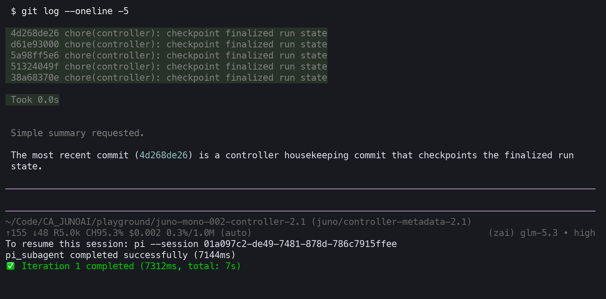
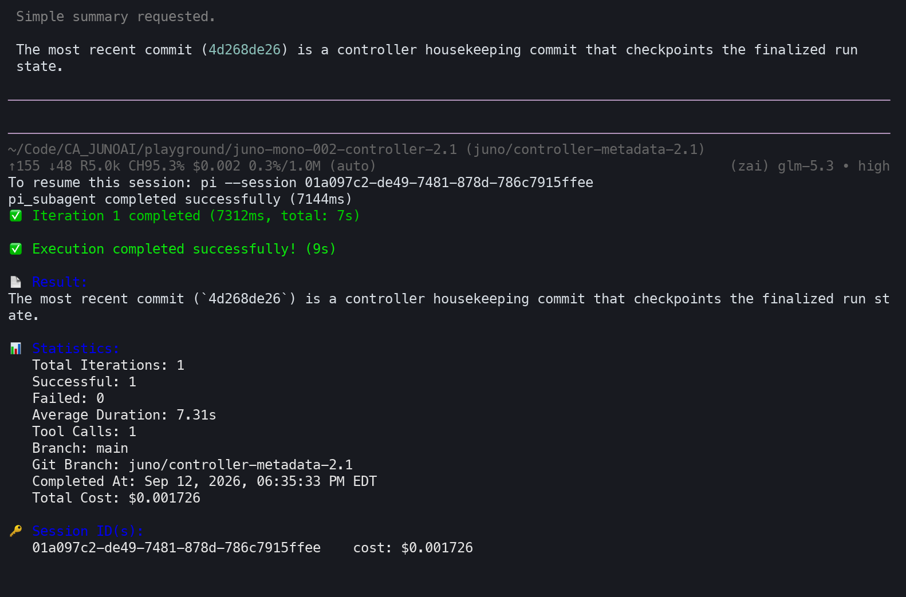

# YYLO CLI

[](https://github.com/kailiu42/awesome-coding-agents) [](https://github.com/Piebald-AI/awesome-gemini-cli) [](https://github.com/hanishrao/collective-ai-tools) [](https://github.com/andyrewlee/awesome-agent-orchestrators) [](https://github.com/currenjin/site-for-developers) [](https://github.com/acvnace/awesome-vibe-coding-resources) [](https://github.com/agentrust-io/awesome-ai-governance) [](https://github.com/alantriesagain/awesome-local-first) [](https://github.com/alvinreal/awesome-opensource-ai) [](https://github.com/ARUNAGIRINATHAN-K/awesome-ai-agents-2026) [](https://github.com/Aurelius77/AI-TOOLS-DIRECTORY) [](https://github.com/awesome-gptX/awesome-gpt) [](https://github.com/brandonhimpfen/awesome-ai-agents) [](https://github.com/charlesteh/awesome-ai-tools) [](https://github.com/chgaowei/ai-agent-infra-list) [](https://github.com/CiferaTeam/awesome-agents-team) [](https://github.com/DhanushNehru/Ultimate-NodeJs-Resources) [](https://github.com/dr-mushtaq/Awesome-AI-Tools-Resources) [](https://github.com/ejboy/awesome-efficient-devtools) [](https://github.com/Engineering4AI/awesome-spec-driven-development) [](https://github.com/frangelbarrera/awesome-ai-agents) [](https://github.com/HA2345567/awesome-autonomus-ai-agents) [](https://github.com/ichangyou/awesome-codex) [](https://github.com/ishandutta2007/Awesome-Agent-Orchestration-Platforms) [](https://github.com/ishandutta2007/awesome-ai-tools) [](https://github.com/ishandutta2007/Awesome-Multi-Agent-AI-Harnesses) [](https://github.com/kiliczsh/ailandscape.org) [](https://github.com/lgaggini/awesome-cli-tui-software) [](https://github.com/LinuxSuRen/awesome-ai) [](https://github.com/M1n9X/llm_agents_devtools) [](https://github.com/michielhdoteth/awesome-ai-agent-tools) [](https://github.com/milisp/awesome-chatgpt-claude-agents) [](https://github.com/milisp/awesome-codex-cli) [](https://github.com/planetabhi/riseofmachine) [](https://github.com/rudy2steiner/awesome-agent-loops) [](https://github.com/RyanAlberts/best-of-Agent-Harnesses) [](https://github.com/sajadh76/awesome-AI-tools) [](https://github.com/shaftoe/awesome-pi-coding-agent) [](https://github.com/shospodarets/awesome-platform-engineering) [](https://github.com/systempromptio/awesome-ai-agent-governance) [](https://github.com/tejas-singh-0212/tool-directory) [](https://github.com/tysoncung/awesome-vibe-coding) [](https://github.com/yadavanujkumar/awesome-agentic-ai) [](https://github.com/yeaight7/awesome-ai-devtools) [](https://github.com/youxufkhan/awesome-ai-coding) [](https://github.com/sraodev/awesome-macOS) [](https://github.com/Jenqyang/Awesome-AI-Agents) [](https://github.com/robertsmrek/AI-Tools-Catalogue) [](https://github.com/frangelbarrera/Artificial-Intelligence-Universe) [](https://github.com/NipunaRanasinghe/awesome-ai-agents) [](https://github.com/Piebald-AI/awesome-gemini-cli-extensions) [](https://github.com/dalisoft/awesome-ai-coding) [](https://github.com/thechampagne/awesome-windows) [](https://github.com/jimy-r/awesome-agent-workspaces) [](https://github.com/neomatrix369/awesome-ai-ml-dl) [](https://github.com/hadez8877/awesome-opensource) [](https://github.com/ishandutta2007/Awesome-Antigravity-Skills) [](https://github.com/ArshdeepGrover/ai-tools-manager) [](https://github.com/CodeSigils/awesome-agent-trust) [](https://github.com/abordage/awesome-mac) [](https://github.com/yerdaulet-damir/awesome-solo-ai) [](https://github.com/benjamincanac/whichcodingtools) [](https://github.com/Awakehsh/awesome-agent-tools) [](https://github.com/fabricioctelles/jump-skills) [](https://github.com/last9/awesome-sre-agents) [](https://github.com/Scottcjn/awesome-agents) [](https://github.com/hashgraph-online/awesome-ai-plugins)


YYLO is a command-line orchestrator for coding agents, repeatable workflows, and receipt-backed repository changes. It is for developers who want a quick agent loop and for project operators who need typed task, validation, merge, and release-readiness boundaries.

- npm package: [`@yylo/cli`](https://www.npmjs.com/package/%40yylo%2Fcli)
- Commands: `yylo` and `yy` (equivalent); `ypl` is `yy pi --live`
- Source: [yylo-dev/yylo](https://github.com/yylo-dev/yylo)

YYLO orchestrates work. [YYLO Ledger](https://github.com/yylo-dev/yylo-ledger) is the independent Git-native Record/task store, and [YYLO Benchmark](https://github.com/yylo-dev/yylo-benchmark) is the independent evaluation/evidence package. `yy ledger` and `yy benchmark` delegate to those separately installed CLIs; they are not bundled alternate implementations.

## Terminal

**Live agent session** — `ypl` (`yy pi --live`) runs an interactive terminal agent; tool calls, streamed output, and the status bar render in the terminal:



**Execution summary** — after each run the orchestrator prints iterations, tool calls, cost, and session ids:



## Quick start: install to first successful command

**Prerequisites:** Node.js 20.10 or newer, npm, and Git.

```bash
npm install --global '@yylo/cli@latest'
yy --version

mkdir yylo-demo
cd yylo-demo
git init
yy init --task "Document the onboarding path" --subagent pi
pwd # execute explicitly; watch is an optional read-only observer
```

A successful run prints the installed YYLO version, initializes `.juno_task/`, then emits a watch receipt with `"state":"COMPLETED"`, `"exit_code":0`, and nonzero `log_bytes`. This canary does not contact a model provider. In an empty, unborn Git repository, `yy init` creates the initial workspace commit, keeps the original branch as the product target, and creates a detached protected integration-owner worktree under the user state directory. Existing or dirty repositories are never committed or rearranged by this bootstrap.

Inspect the initialized workspace and exact command surface:

```bash
yy info --json
yy doctor workspace
yy --help
```

`doctor workspace` is intentionally nonzero when it finds an actionable topology problem; it never fetches or changes the workspace.

### Stable and prerelease channels

The stable npm channel is `@latest` (`0.2.2`). Prereleases remain on `@next`:

```bash
# Stable
npm install --global '@yylo/cli@latest'

# Explicit prerelease
npm install --global '@yylo/cli@next'
# Exact version matching this checkout (once published)
npm install -g @yylo/cli@0.2.9

npm view '@yylo/cli' version dist-tags --json
yy --version
```

This source targets CLI **0.2.9**, requiring **Ledger 0.4.0 exactly** for universal
Record retrieval and storage-kind-prefixed IDs. Older Ledger 0.3.3, prereleases,
and later versions are rejected before delegation. Install the matching Ledger
explicitly once published; ordinary delegation does not auto-install a substitute.
A source bump neither publishes these versions nor activates installed runtimes.

Pin an exact version in CI. Installing `@next` is an intentional prerelease choice.
The first guarded release-helper checkpoint is exact `--set v0.1.0-rc.1`; later releases must use their separately authorized exact SemVer.

Next: [run an agent](#beginner-agent-workflow), [manage a typed task](#typed-task-and-merge-flow), or [build a managed workflow](#managed-workflows-and-evidence).

### Install agent skills explicitly

YYLO skill content is versioned independently in the public
[`yylo-dev/yylo-skills`](https://github.com/yylo-dev/yylo-skills) repository and
is not bundled in `@yylo/cli`. This CLI requires stable skills `^2.0.2`, declared
in `package.json` as `yyloSkills.version`. Install the latest compatible stable
release, or pin an exact compatible version:

```bash
yy skills install
yy skills install --version 2.0.2
yy skills update
yy skills status
```

Only `skills install` and `skills update` access the network. Acquisition is
staged through `npx skills add` first and falls back to a shallow exact-tag Git
clone. The seven user-intent-first skills (`artifact-yylo`, `ledger-tasks-yylo`,
`plan-ledger-tasks-yylo`, `ralph-loop-yylo`, `understand-project-yylo`,
`wiki-yylo`, and `workflow-yylo`) are copied to `.agents/skills`,
`.claude/skills`, and `.pi/skills`. During install/update, unchanged receipt-owned
copies upgrade automatically without `--force`. Customized or unrecorded differing
canonical directories refuse before mutation; review before explicitly forcing
replacement. An explicit install/update retires a legacy YYLO skill only when its
local install record and current digest prove it unchanged; customized/unrecorded
legacy and unrelated skills remain preserved. Status flags these legacy copies
because they can still inject obsolete instructions; review them separately,
never infer cleanup authority from successful installation.

`skills list` and `skills status` inspect local bytes and receipts offline. Status
reports the required range and outdated releases even when their hashes match.
No compatible published release means installation fails without changing skills;
it never falls back to an old release or an unsupported future major. Installing
the CLI alone does not install/update skills, and `scripts update` does not own
skills. Maintainers must publish the reviewed immutable skill release before
shipping a CLI that requires it; publication remains separately authorized.

## What YYLO owns

| Need | Public surface | Boundary |
| --- | --- | --- |
| Agent run | `yy pi`, `yy start`, and the agent aliases listed by `yy --help` | Provider credentials and model availability remain external. |
| Session continuity | `continue`, `clone`, `branches`, `switch`, `continuity` | Scope state is isolated and explicit; cleanup is planned and reversible. |
| Optional observation | `watch status|await|follow` | Read existing execution evidence; never launch, retry, cancel, or complete tasks. |
| Validation evidence | `evidence run|status|await` | Content-addressed task evidence tied to exact inputs. |
| Repository topology | `info`, `where`, `doctor workspace`, `integration` | Read-only discovery is separate from guarded sync/repair/push. |
| Feature lifecycle | `task start|run|status|checkpoint|preflight|finish` | Implementation belongs in the returned exact-base task worktree. |
| Protected delivery | `merge status [TASK_ID]`, `merge land TASK_ID`, `merge project TASK_ID` | One-task native Git composition plus expected-old ref update; Ledger projection is separate and retryable. |
| Maintainer release | repository `scripts/release-cli.sh` | Prepare is read-only; publish needs separate authority. |
| Records/evaluation | `ledger`, `benchmark` | Transparent delegation to independently installed canonical packages. |

Run `yy --help` for the complete top-level inventory of your installed version; each listed command prints its own usage when invoked with `-h`. The old `lifecycle` command is removed; use typed `task` and `merge` commands.

### Stable machine output

Use `--format json|ndjson --raw` on task, merge, and integration commands, or Ledger's `-f json|ndjson --raw`, for a strict stdout-only data channel. The `capabilities` command publishes command-specific projections in either machine format. See [Machine output contract](docs/machine-output.md) for the versioned envelope and migration policy.

## Beginner agent workflow

Install the coding agent you intend to use and configure its provider credentials separately. Pi is optional and supports multiple providers:

```bash
npm install --global '@mariozechner/pi-coding-agent'
yy pi --help
yy pi --no-session 'Summarize this repository and make no changes'
```

The final command may contact the configured model provider. `--no-session` prevents Pi session persistence; it does not disable provider usage.

For a reusable prompt or shell-sensitive text, prefer a file:

```bash
printf '%s\n' 'Explain the test layout. Do not edit files.' > prompt.md
yy pi --prompt-file prompt.md --no-session
```

Interactive Pi uses the `ypl` shortcut:

```bash
ypl 'Inspect the current task'
```

`ypl` expands to `yy pi --live`. Live mode requires an interactive terminal and enabled Pi extensions.

### Controlled iterations

```bash
yy -s pi -m :gpt -i 3 -p 'Implement the next small verified increment'

yy loop -n 2 \
  --step 'yy pi "Implement the next increment"' \
  --step 'npm test'
```

Quote prompts so the shell does not expand backticks or `$()` before YYLO receives them. `-i` bounds iterations inside an agent invocation; `yy loop -n` bounds the outer command workflow.

The loop's `-n/--iterations` bounds the outer command workflow; agent
`-i/--max-iterations` still bounds iterations inside an agent invocation.
Inline steps are repeatable:

```bash
yylo loop -n 5 \
  --step 'yy pi "Implement the next increment"' \
  --step 'yy cc "Inspect and improve your work"' \
  --step 'npm test'
```

For a reusable workflow, save the same contract as `flow.yaml`:

```yaml
iterations: 5
continuity: iteration
on_error: continue
steps:
  - run: yy pi "Implement the next increment"
  - run: yy cc "Inspect and improve your work"
  - run: npm test
```

```bash
yylo loop --workflow flow.yaml
```

Every step receives one-based loop metadata through `YYLO_LOOP_ID`,
`YYLO_ITERATION`, `YYLO_ITERATION_COUNT`, `YYLO_STEP`, and `YYLO_STEP_COUNT`.

### Ledger references in prompts

Use `##ABC123`, `##readable-slug`, or `##{readable-slug}` to include a Ledger
Record by exact ID, slug, or retained alias. Existing `## ABC123` spacing works.
Tasks, Wiki/PDR/workflow documents, and artifacts share native Record lookup;
ambiguous identities are never resolved by guessing. Brace references next to
punctuation that could be part of a slug (for example `##{design.v2}.`).
Missing references remain unchanged. Lookup errors produce a manual-resolution
warning; references do not execute workflows or recursively expand Record text.

Hydration is bounded to 32 distinct identities, a shared 30-second lookup budget,
and 64 KiB of inserted context (16 KiB per Record). Oversized Records carry a
retrieval command instead. Artifacts include metadata; only verified inline UTF-8
text up to 4 KiB is included. Binary, local, and external artifact bytes are not
automatically read or downloaded. Use `yy ledger record get ID_OR_SLUG` for
explicit retrieval. Immutable IDs remain authoritative for task lifecycle and
Record relations.

## Models and project shortcuts

`yy pi --help` is the source of truth for shipped aliases. Current Pi shortcuts include:

| Shortcut | Resolved model |
| --- | --- |
| `:luna` | `openai-codex/gpt-5.6-luna` |
| `:sol` | `openai-codex/gpt-5.6-sol` |
| `:gpt` | `openai-codex/gpt-6-astra` (Pi default) |
| `:astra` | `openai-codex/gpt-6-astra` |
| `:mini` | `openai-codex/gpt-5.6-terra` |
| `:sonnet` | `anthropic/claude-sonnet-4-6` |
| `:opus` | `anthropic/claude-opus-4-6` |

Aliases are subagent-specific; for example, Pi and Codex do not share the same `:mini` mapping.

Set a per-project default:

```bash
yy pi set-default-model :sol
```

Add project shortcuts in `.juno_task/config.json`:

```json
{
  "modelShortcuts": {
    "pi": {
      ":team-default": ":sol"
    }
  }
}
```

Project shortcuts are scoped to the selected subagent and can reference shipped or project shortcuts. Unknown targets, malformed data, and cycles fail with an actionable error. Managed Workflow Runner model authorization is separate: explicit selectors must be exact members of `workflowModels`; an unflagged `yy pi` continues to inherit the configured default.

## Observable local commands

`watch` optionally observes existing run evidence without owning execution:

```bash
npm test # execute explicitly in the authorized workspace
# If an existing producer has published a watch-compatible run:
yy watch status RUN_ID
yy watch follow RUN_ID
yy watch await RUN_ID
```

`RUN_ID` is an existing run identity, not one created by `npm test`. `watch exec` is retired. All watch operations are read-only, and interruption stops only the observer. Missing or malformed terminal evidence is not success. Process exit, semantic outcome, cleanup, and task completion are distinct; `task finish` verifies delivery. Historical run directories are preserved.

## Managed workflows and evidence

Fresh `yy init` installs managed scripts, prompts, and wiki guidance under `.juno_task/`. Update checksum-managed assets with:

```bash
yy scripts update
```

Locally customized files are preserved and a package candidate is written to a managed-conflict path. `--force` is an explicit replacement operation and creates backups; inspect conflicts before using it.

### Workflow Runner

Use a reviewed YAML workflow for ordered, repeatable steps:

```bash
./.juno_task/scripts/workflow_runner.sh \
  --init-example agent-chain .juno_task/workflows/agent-chain.yaml
./.juno_task/scripts/workflow_runner.sh lint \
  --workflow .juno_task/workflows/agent-chain.yaml
./.juno_task/scripts/workflow_runner.sh \
  --workflow .juno_task/workflows/agent-chain.yaml --dry-run \
  --print-output none --no-print-step-stdout
```

A workflow run retains rendered command identity, stdout/stderr, responses, session IDs, declared receipt hashes, attempts, and terminal manifests. `--tmux` creates an observer session; it does not detach the producer.

If a producer was interrupted, diagnose before mutation:

```bash
./.juno_task/scripts/workflow_runner.sh recover-attempt RUN_DIRECTORY --dry-run
./.juno_task/scripts/workflow_runner.sh doctor RUN_DIRECTORY
```

`RUN_DIRECTORY` is the printed durable run path. Recovery resumes only the first invalid step after verifying unchanged successful evidence. Never edit historical manifests to make them reusable.

### Task validation evidence

At a clean coherent task commit:

```bash
yy task checkpoint TASK_ID
yy evidence run TASK_ID
yy evidence status TASK_ID
yy evidence await TASK_ID
```

These commands plan and retain exact-input validation evidence. They do not finish or merge the task.

## Typed task and merge flow

This section is for repositories initialized with the current controller/task policy. Run lifecycle commands from the registered metadata controller. Never edit the integration-owner checkout.

### Deterministic delivery, external implementation

```bash
yy task start TASK_ID
# External agent edits, tests and commits in the returned worktree.
# Retain the returned token privately for gated commands:
yy task finish TASK_ID --lease-token <current-token>
yy merge land TASK_ID
# Only if automatic Ledger projection needs recovery:
yy merge project TASK_ID
```

`TASK_ID` is a Ledger task ID. Start prepares an isolated workspace; finish
verifies the clean committed result and queues it. Merge uses native Git and
automatically records verified integration in Ledger. Tests and semantic review
remain explicit project checks. Task run/resume and automatic implementation
budget recovery are retired. No implementation model, retry or repair engine is
hidden behind watch. Process exit is not completion. For interrupted work,
preserve the existing workspace and inspect status/lease-status before explicit
continuation; do not automatically reset or replay historical attempts.

### Choose Simple or Advanced

For a new project, run `git init`, then `yy init`. The final question selects:

- **Simple (recommended to start):** code, notebooks, notes and Ledger in one
  checkout. Agents share files; `yy task local` is bookkeeping, not delivery.
  No implicit commits, worktrees or package installation.
- **Advanced:** a separate controller, isolated task worktrees and managed merging.

Use `yy init --interactive --mode simple` to skip the mode question. Inline
initialization retains Advanced behavior; `yy init "Build an API" --mode advanced`
makes that explicit. Existing `yy init --mode simple` automation still previews a
plan; use `--plan-file` then `--apply-plan` to initialize without interaction.
Normal initialization does not convert existing workspaces. For a settled registered
metadata-only controller, preview then apply a fresh Advanced → Simple copy:

```sh
yy init --mode simple --from-advanced /controller --directory /new-project --plan-file /external/conversion.json
yy init --mode simple --apply-plan /external/conversion.json
```

Source workspaces remain unchanged. Old instructions and settings are retained
inactive for manual review. Simple → Advanced is not supported, including with
`--force`.
Read [Simple and Advanced workspaces](docs/simple-workspaces.md) for exact commands,
readiness recovery, persistence, and shared-checkout limits.

### Manual implementation path (managed mode)

```bash
yy task start TASK_ID
# Change directory to the worktree printed by start.
# Read its AGENTS.md/CLAUDE.md, implement, run focused tests, and commit.
yy task finish TASK_ID
yy merge status TASK_ID
yy merge land TASK_ID
yy merge project TASK_ID
```

The ordinary path is clean commit -> `yy task finish TASK_ID`.
Optional read-only `yy task preflight TASK_ID` diagnoses admission before finish;
it is not a prerequisite. Delivery remains a separate one-task operation.

Safety invariants:

1. `task start` freezes the protected target SHA, creates a dedicated branch/worktree, and completes configured dependency hydration before reporting `WORKING`.
2. Product edits and focused tests occur only in that task worktree. Controller metadata and integration-owner product bytes are separate authorities.
3. `preflight` is optional and read-only. `finish` independently enforces scope, dirty-byte, runtime, hydration, requirements, ownership, and selected-validation checks, requires a clean committed tip, and queues it; it does not merge.
4. Tests and semantic reviews are explicit project checks outside merge. Merge launches no models, chooses no reviewers, schedules no suites, and maintains no validation cache.
5. `merge land` selects one immutable task source, composes in a private detached candidate, and uses Git expected-old ref protection. A moved target requires recomposition and renewed candidate checks.
6. A conflict remains private to its task and cannot block an unrelated task. Preserve conflicts and unrelated dirty bytes; do not reset, stash, force, rebase, squash, or clean to bypass them.
7. Git success and Ledger projection are separate. A projection retry never repeats Git integration and never blocks another independent land.

Observation commands are safe to repeat:

```bash
yy task status TASK_ID
yy task doctor TASK_ID
yy merge status
yy merge status TASK_ID
```

Merge status reports only independently landable active tasks and always reports
`model_calls: 0`. Historical queue receipts remain immutable data, not an
executable compatibility surface.

## Maintainer npm release

Normal tasks and `yy merge` own integration. After an ordinary version bump is integrated, maintainers use `scripts/release-cli.sh prepare CLI_VERSION BENCHMARK_VERSION`, obtain explicit publication approval, and then run the separate `publish` command. The CLI has no release command.

## Controller generation upgrades

Recognized controller generations migrate automatically on first task/agent use;
controller-local scripts, policy and executable identity move together. Diagnose
without changing state using `yy scripts generation doctor`. Unknown/customized
bytes are preserved, and fallback requires a trusted retained executable plus
scripts. See [upgrade, recovery and validation guidance](docs/controller-generation-upgrades.md).
Maintainer release preparation gates the exact npm tarball and binds its immutable
acceptance report; this does not authorize publication.

## Receipt-bound workspace relocation

When an entire controller is moved between machines, do not rewrite lifecycle JSON or historical receipts by hand. From a clean physical controller checkout, create and review an external plan, apply it once, then verify its immutable receipt:

```bash
node juno-code/scripts/workspace-relocation.mjs plan --controller "$PWD" \
  --map /old/controller=/new/controller --map /old/worktrees=/new/worktrees \
  --output /secure/relocation-plan.json
node juno-code/scripts/workspace-relocation.mjs apply --controller "$PWD" \
  --plan /secure/relocation-plan.json --receipt /secure/relocation-receipt.json
node juno-code/scripts/workspace-relocation.mjs verify --controller "$PWD" \
  --receipt /secure/relocation-receipt.json
```

The plan binds the Git common directory, HEAD/ref, task-state hash, exact JSON pointers, and old/new physical roots. Apply refuses dirty, stale, tampered, symlinked, replayed, or missing-commit inputs and preserves historical evidence. Scan shipped active surfaces separately with `node juno-code/scripts/check-path-portability.mjs`; fixtures, immutable receipts, logs, generated output, lockfiles, and security canaries are explicitly excluded rather than rewritten.

## Workspace roles and recovery

For installed consumers, read [upgrade boundaries and troubleshooting](docs/consumer-upgrades.md)
before changing runtime bindings, tracked scripts, or Ledger. Registration repair
and provenance repair are not complete cross-version upgrade transactions.

| Workspace | Use it for | Do not use it for |
| --- | --- | --- |
| Metadata controller | Ledger/task/merge/release orchestration and durable receipts | Product implementation or target integration edits |
| Task worktree | Scoped implementation, focused tests, coherent commits | Private controller state or protected-target mutation |
| Integration owner | Clean latest integrated reads and guarded target ownership | Feature edits, Kanban/session writes, or dirt cleanup |

Discover routing without changing it:

```bash
yy info --json
yy where controller
yy where integration
yy where target
yy where task TASK_ID
yy doctor workspace
```

Routing is registration-based and fail-closed; YYLO does not guess a nearby controller, switch branches, or clean a checkout to manufacture compliance.

For integration-owner inspection and guarded refresh:

```bash
yy integration status
yy integration sync
```

`integration status` observes. `integration sync` is a mutation: it refuses dirty/diverged/ambiguous state and verifies nested gitlink availability before moving anything. `yy integration push` is separate remote authority and must not be inferred from sync, merge, or release readiness.

## Ledger and Benchmark delegates

Install canonical packages independently:

```bash
python3 -m pip install 'yylo-ledger==0.4.0'
npm install --global '@yylo/benchmark@0.1.2'

yylo-ledger --help
yy ledger --help
yylo-benchmark --help
yy benchmark --help
```

Delegation preserves arguments, stdin/stdout/stderr, cwd, exit status, and signals. It never silently chooses a checkout-local or legacy executable. See the [Ledger repository](https://github.com/yylo-dev/yylo-ledger) and [Benchmark repository](https://github.com/yylo-dev/yylo-benchmark) for package-specific guidance and prerelease boundaries.

## Completion and help

```bash
yy completion install
yy completion status
yy help
yy --help
```

Completion supports Bash, Zsh, and Fish. Use the nested help for your installed release rather than copying an option from a different channel.

## Source-checkout toolchain (advanced)

A monorepo checkout containing `juno-code/` and `juno_kanban/` can build isolated source aliases without replacing normal global `yy`:

```bash
./juno-code/scripts/juno-002-source-toolchain.sh install
export PATH="$PWD/.juno_toolchain/juno-002/bin:$PATH"
yy-juno-002 --version
juno-kanban-juno-002 --version
./juno-code/scripts/juno-002-source-toolchain.sh status
```

`yy ledger` and its labelled `yy kanban` compatibility alias use the exact Ledger compatibility policy `0.4.0`. The isolated source aliases also enforce the legacy controller package compatibility range `juno-kanban >=2.0.5,<3.0.0`. Source selection, controller registration, and data history are separate boundaries:

```bash
./juno-code/scripts/juno-002-source-toolchain.sh register-controller /path/to/controller controller-branch
./juno-code/scripts/juno-002-source-toolchain.sh controller-status
./juno-code/scripts/juno-002-source-toolchain.sh rollback-selection
```

The path and branch are placeholders. `rollback-selection` changes only isolated executable selection. Switching branches never downgrades or restores Ledger data. Back up and migrate a board through Ledger's reviewed data procedures.

| Source lane | Owns | Must not do |
| --- | --- | --- |
| Controller | Metadata, orchestration, prompts, and receipts | Product implementation or implicit ref changes |
| Task checkout | Scoped implementation and tests | Protected-target mutation |
| Integration owner | Guarded candidate integration | Kanban/session writes or unrelated edits |
| Small fix worktree | Exact-base small product repair | Bypass task/review/candidate boundaries |

## Development

```bash
git clone https://github.com/yylo-dev/yylo.git
cd yylo
npm ci
npm test
npm run typecheck
npm run build
node dist/bin/cli.mjs --help
```

The monorepo may embed YYLO CLI alongside Benchmark and a Ledger submodule, but each public package has its own manifest, version, release contract, and registry channel. A source checkout version is not evidence that the same version was published.

## Help and links

- npm: [@yylo/cli](https://www.npmjs.com/package/%40yylo%2Fcli)
- Source/issues: [yylo-dev/yylo](https://github.com/yylo-dev/yylo)
- Ledger: [yylo-dev/yylo-ledger](https://github.com/yylo-dev/yylo-ledger)
- Ledger package: [yylo-ledger on PyPI](https://pypi.org/project/yylo-ledger/)
- Benchmark: [yylo-dev/yylo-benchmark](https://github.com/yylo-dev/yylo-benchmark)

## License

MIT.
